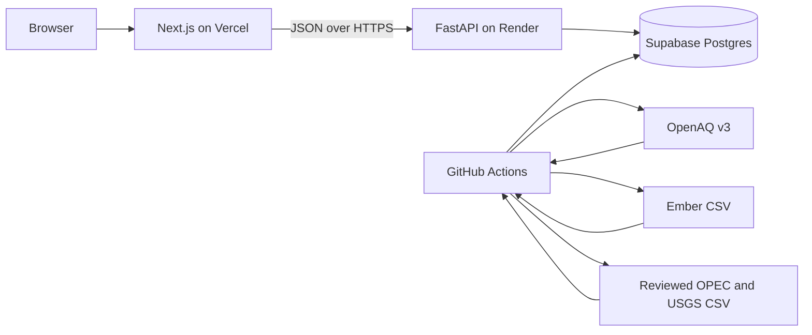

# Earth Vitals

Earth Vitals is an open-source environmental dashboard that turns public air-quality, electricity, and mineral-reserve data into explorable time series. It includes a transparent, adjustable Planetary Health Index and deliberately simple forward scenarios whose assumptions are visible to the user.

The project is a portfolio-quality MVP, not an authoritative scientific assessment. Every score and projection should be read together with the methodology notes below.

## What it includes

- Three independently runnable ingestion pipelines for OpenAQ, Ember, OPEC, and USGS data.
- A PostgreSQL/Supabase data store accessed through SQLAlchemy.
- A typed FastAPI read/projection API.
- A Next.js 14 dashboard with domain pages, Recharts histories and scenarios, a stylized world map, and adjustable index weights.
- Scheduled GitHub Actions with manually runnable fallbacks.

## Architecture



The monorepo keeps deployment boundaries explicit: Vercel builds `frontend/`, Render starts `backend.app.main:app`, and GitHub Actions invokes the Python modules from the repository root.

## Repository layout

```text
frontend/                 Next.js App Router UI
backend/app/              FastAPI, SQLAlchemy models, index and projection logic
backend/pipeline/         OpenAQ, energy, and minerals ingestion commands
backend/scripts/          Database initialization and sample seeding
backend/data/             Small reviewed input files (large Ember CSV is ignored)
.github/workflows/        Scheduled ingestion jobs
render.yaml               Render Blueprint for the API
```

## Local setup

Prerequisites: Python 3.12, Node.js 20+, npm, and a PostgreSQL database. A Supabase project is convenient but any PostgreSQL connection string works.

1. Copy `.env.example` to `.env` and set at least `SUPABASE_DB_URL`. Set `OPENAQ_API_KEY` to run the OpenAQ pipeline.
2. Create and activate a virtual environment, then install the backend dependencies:

   ```shell
   python -m venv .venv
   python -m pip install --requirement backend/requirements.txt
   ```

3. Create the tables and optionally seed/print the demonstration rows:

   ```shell
   python backend/scripts/init_db.py
   python backend/scripts/seed_sample.py
   ```

4. Run the real ingestion commands from the repository root:

   ```shell
   python -m backend.pipeline.openaq_ingest
   python -m backend.pipeline.energy_ingest
   python -m backend.pipeline.minerals_ingest
   ```

   Ember's large source CSV is not committed. Download its current yearly release and point `ENERGY_DATA_CSV_PATH` to it first. See [`backend/pipeline/README.md`](backend/pipeline/README.md) for source and refresh details.

5. Start the API:

   ```shell
   python -m uvicorn backend.app.main:app --reload --port 8000
   ```

6. In another terminal, start the frontend:

   ```shell
   cd frontend
   npm install
   npm run dev
   ```

   `frontend/.env.local` should contain `NEXT_PUBLIC_API_BASE_URL=http://localhost:8000`.

## Environment variables

| Name | Used by | Purpose |
| --- | --- | --- |
| `SUPABASE_DB_URL` | API and pipelines | PostgreSQL connection string; store as a secret. |
| `FRONTEND_ORIGIN` | API | Exact deployed frontend origin allowed by CORS; localhost remains enabled for development. |
| `NEXT_PUBLIC_API_BASE_URL` | Frontend | Public HTTPS base URL of the deployed API. |
| `OPENAQ_API_KEY` | OpenAQ pipeline | Free OpenAQ v3 API key; store as a GitHub secret. |
| `ENERGY_DATA_CSV_PATH` | Energy pipeline | Local path to Ember's yearly CSV. |
| `MINERALS_DATA_CSV_PATH` | Minerals pipeline | Local path to the normalized OPEC/USGS CSV. |

The other API-key placeholders in `.env.example` reserve names for future integrations and are not currently consumed.

## Scheduled ingestion

OpenAQ runs daily at 05:17 UTC because its readings change continuously. Ember energy and reviewed OPEC/USGS reserves run monthly, on different days and minutes: their authoritative releases are annual, so weekly execution would add traffic without materially improving freshness. All three workflows support manual dispatch.

Configure these GitHub repository Actions secrets:

- `SUPABASE_DB_URL`
- `OPENAQ_API_KEY`

The energy workflow downloads Ember's latest published CSV at run time. The minerals workflow ingests the reviewed `backend/data/minerals_reserves.csv`; when a new annual edition is published, that file still requires a documented human review and commit.

## API surface

The API exposes `/health`, `/metrics`, metric history/latest routes, domain summaries, `/index/current`, `PUT /index/weights`, and `POST /projections/{metric_key}`. Request/response examples are in [`backend/app/README.md`](backend/app/README.md).

## Live deployment

- Dashboard: [https://earth-vitals-xi.vercel.app](https://earth-vitals-xi.vercel.app)
- API health: [https://earth-vitals-api.onrender.com/health](https://earth-vitals-api.onrender.com/health)
- Source: [github.com/KothariMayaank/Earth-Vitals](https://github.com/KothariMayaank/Earth-Vitals)

## Deployment

### API on Render

Create a Blueprint from this repository's `render.yaml`. Supply `SUPABASE_DB_URL` and `FRONTEND_ORIGIN` when prompted. After deployment, verify the `/health` route returns `{"status":"ok"}`.

### Frontend on Vercel

Import the same repository, choose `frontend` as the Root Directory, and set `NEXT_PUBLIC_API_BASE_URL` to the Render origin without a trailing slash. After Vercel assigns the production URL, set Render's `FRONTEND_ORIGIN` to that exact origin and redeploy the API.

## Methodology and limitations

### Planetary Health Index

The normalization policy is reviewable in `backend/app/index_config.py`. Each raw metric is linearly mapped between a concerning endpoint (score 0) and a healthy endpoint (score 100), then clamped. Metrics within a domain are averaged equally. The overall score is the weighted average of the three domain scores; the UI begins at roughly equal weights and lets users change them.

Current assumptions:

| Metric | Concerning (0) | Healthy (100) | Direction and caveat |
| --- | ---: | ---: | --- |
| Renewable electricity share | 20% | 60% | Higher is better; this is electricity, not total energy or reliability. |
| Global electricity generation | 40,000 TWh | 20,000 TWh | Lower is used as a rough pressure proxy. This is the weakest assumption because access is beneficial and clean generation has lower impact. |
| Proved oil reserves | 1,800 billion barrels | 800 billion barrels | Lower means less potential carbon lock-in, but depletion through extraction is not itself healthy. |
| Lithium reserves | 20 million tonnes | 50 million tonnes | Higher reduces transition-supply scarcity, but ignores mining impacts, grade, concentration, and recycling. |
| PM2.5 concentration | 35 µg/m³ | 5 µg/m³ | Lower is better; 5 reflects the [WHO annual guideline](https://www.who.int/teams/environment-climate-change-and-health/air-quality-and-health/health-impacts/types-of-pollutants). The OpenAQ aggregation is sensor-weighted, not population- or area-weighted. |

These endpoints are transparent policy choices, not discovered scientific constants. The electricity-generation proxy should be replaced by carbon intensity or per-capita demand when those series are available. The editable weights are stored in the shared database, so in this MVP one user's change is visible to all users rather than being a private preference.

The map is intentionally illustrative. The current MVP stores global aggregates, not country-level observations, so it does not imply geographic precision.

### Projection scenarios

Projection code and assumptions live in `backend/app/projection_config.py`. These are exploratory calculators, not forecasts and not IPCC-grade models.

- Finite resources use the newest reserve estimate and a recent observed decline as an extraction proxy. If history cannot supply one, the code visibly identifies a documented OPEC or USGS production fallback. The user-selected annual change is compounded into extraction, depletion means reaching 1% of baseline reserves, and results beyond 200 years are reported as beyond the modeled horizon.
- Trend metrics compound the latest observed value at a constant user-selected annual percentage through the target year. Physically bounded series such as renewable share are clamped to their configured range.
- Neither model includes policy shifts, discoveries, reserve reclassification, technology, feedbacks, uncertainty intervals, structural breaks, or interactions between metrics. Scenario output must not be used for investment, safety, or public-policy decisions.

### Data freshness and interpretation

Provider cadence differs: OpenAQ is daily, while Ember/OPEC/USGS releases are generally annual. Missing sensors and uneven geographic coverage can bias the PM2.5 mean. Reserve classifications and revisions vary by publisher and year. Always follow the linked source metadata before quoting a value outside this demonstration.

## Verification

Run the backend tests and production frontend checks before deployment:

```shell
python -m unittest discover -s backend/tests -v
cd frontend
npm run lint
npm run build
```

After deployment, check `/health`, each domain page, a weight adjustment, and one finite-resource projection. Browser verification should use the deployed Vercel URL and its network calls must resolve to the deployed Render URL.
